# slides — an agent skill that generates editable `.pptx` decks from a JSON spec

`slides` is a skill for coding agents (Claude Code, Codex, Cursor, and anything that reads
`SKILL.md`). The agent writes the **content** of a deck into a small JSON spec; a
deterministic renderer built on [pptxgenjs](https://github.com/gitbrent/PptxGenJS) owns
**layout, colour and typography**. The output is a native, fully editable PowerPoint file,
not a stack of images.


Works for any kind of deck: class assignments, pitch decks, project or team updates,
lectures, workshops, portfolios, status reviews.

## Why this approach

- **Content and layout are separated.** The model never places a text box. It picks a
  slide type and fills fields; the script guarantees consistent margins, sizes and colours
  across every slide, every run.
- **Restrained editorial style.** One accent colour used only for structure (chips,
  arrows, edges), near-black text, light grey panels, an action title on every slide and a
  one-line takeaway bar. No bullet characters, clip-art, gradients or centred paragraphs.
- **Evidence discipline is built into the instructions.** Every number needs a unit and
  a source, borrowed facts get `[n]` and a references slide, caveats are shown on the slide.
- **Fully editable output.** Shapes, text and charts are native PowerPoint objects, so
  the user can keep working in PowerPoint, Keynote or Google Slides.
- **Visual QA loop.** A render script turns the deck into PNGs and a contact sheet so the
  agent looks at every slide before delivering.

## Install

Requirements: Node 18+. For the visual QA step: LibreOffice (`soffice`) and `pdftoppm`
(poppler). On macOS: `brew install --cask libreoffice && brew install poppler`.

**Claude Code**

```bash
git clone https://github.com/Rich627/slides-skill ~/.claude/skills/slides
npm install --prefix ~/.claude/skills/slides
```

**Any agent that supports the skills CLI** (Codex, Cursor, Claude Code, …)

```bash
npx skills add Rich627/slides-skill
npm install --prefix <path the CLI printed>
```

**Manual**: copy this folder anywhere your agent looks for `SKILL.md`, then run
`npm install` inside it. Nothing else is required.

## Quick start

Ask your agent for a deck (“make me a 10-slide pitch deck for X, navy theme”). The skill
walks it through: purpose and audience → action titles → slide types → `deck.json` →
build → render and inspect → deliver.

Or drive it by hand:

```bash
cp examples/pitch-deck.json deck.json     # edit the content
node scripts/build_deck.js deck.json out/deck.pptx
sh   scripts/render.sh   out/deck.pptx out/render   # PDF + PNG per slide + contact sheet
```

`build_deck.js` exits with code 3 when its estimator thinks text may overflow a box or an
image is missing. Shorten the text or add `\n`, rebuild, confirm in the render.

## The spec

```jsonc
{
  "title": "File title",
  "brand": { "kicker": "ACME", "logo": "logo.png", "logoBox": true },  // chip text + top-right logo, both optional
  "theme": "navy",                        // preset, or { "preset": "navy", "accent": "123456", "font": "Microsoft JhengHei" }
  "section": "Series A",                  // grey label beside the chip; per-slide "section" overrides
  "footer": "acme.example · 2026",        // default footer text when a slide has no "source"
  "slides": [ { "type": "cover", "title": "…" }, … ]
}
```

Light slides accept `title`, `subtitle`, `section`, `source` (footer citation), `note`
(string, or `{ "text": "…", "muted": true }` for a grey caveat), `callout` (the takeaway
bar) and `notes` (speaker notes). `**bold**` works inside any string; `\n` breaks lines.
Image paths are relative to the JSON file.

Full field reference: [`references/slide-types.md`](references/slide-types.md).
Tokens, type scale and geometry: [`references/design-system.md`](references/design-system.md).
Storyline skeletons per deck purpose: [`references/storylines.md`](references/storylines.md).

## Slide types

| | |
|---|---|
| **`cover`** dark opening slide, optional hero image and footer band<br>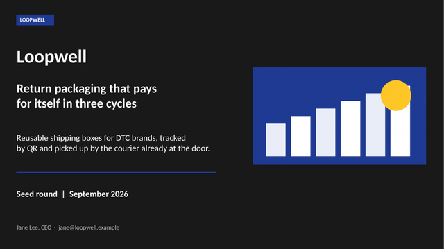 | **`section`** dark divider with a big number<br>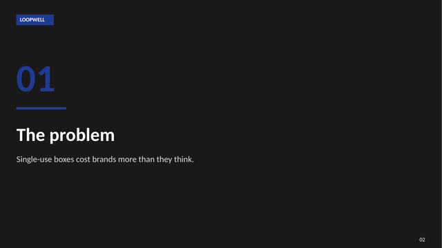 |
| **`cards`** 2–4 panels, numbered or with images, optional bold closing line<br>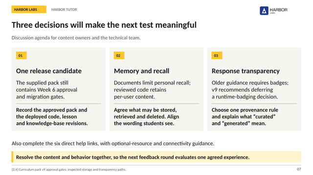 | **`bullets`** 1–2 columns of marked items with optional detail line<br>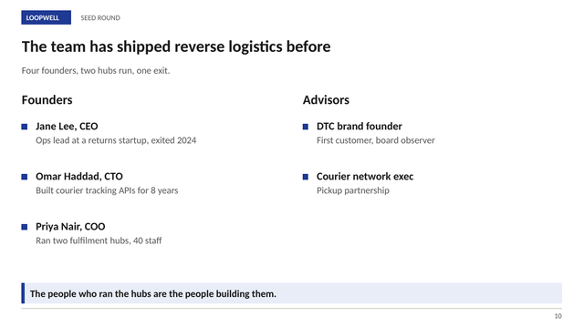 |
| **`table`** header row and hairline rows, first column bold<br>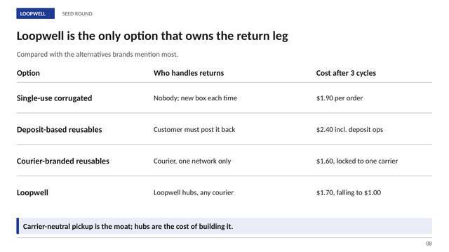 | **`stats`** 2–4 big numbers, dark caveat banner, note lines<br>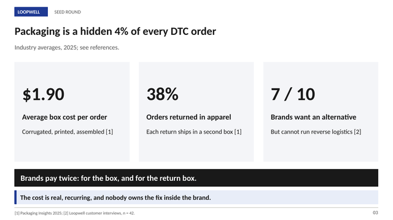 |
| **`flow`** left-to-right process with arrows and a dark band<br>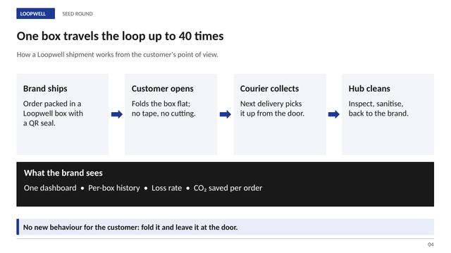 | **`flow`** technical variant: branches, statement, small cards<br>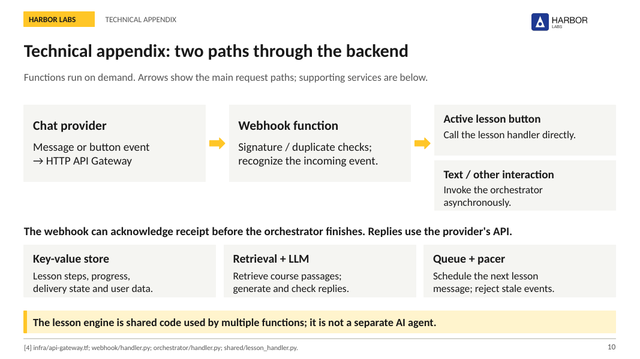 |
| **`timeline`** 3–6 milestones with done / now / next states<br>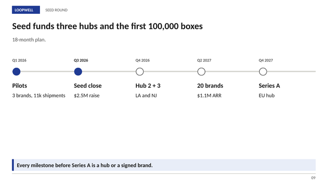 | **`chart`** native bar, column, line, area, pie or doughnut with a side panel<br>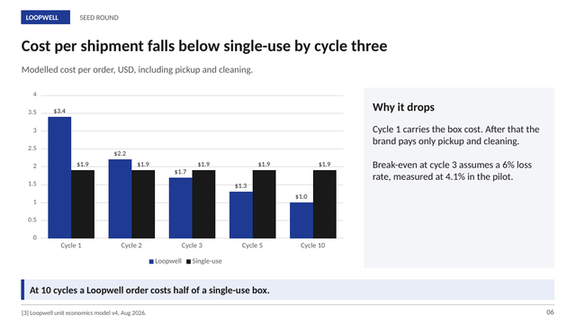 |
| **`image`** picture left, right or full with heading, body and points<br>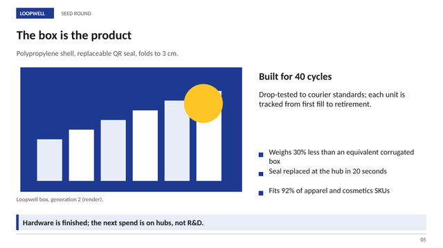 | **`quote`** one statement or quotation<br>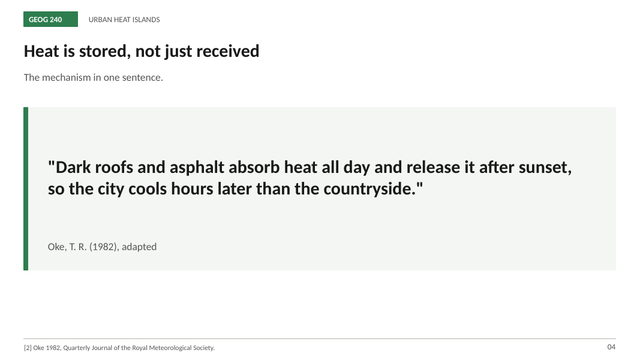 |
| **`options`** excerpt on the left, accent-edged choices on the right<br>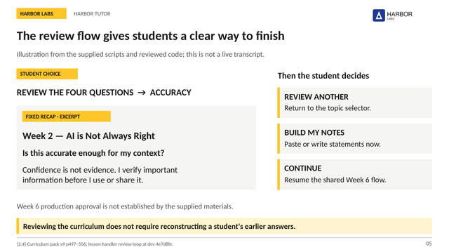 | **`references`** two-column source list with links<br>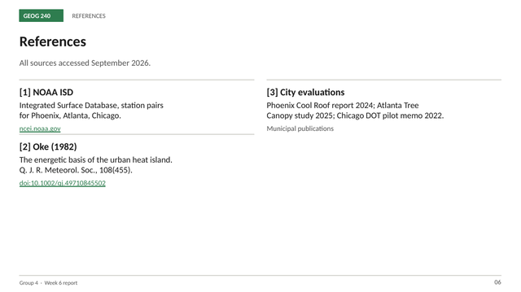 |
| **`next`** dark next-steps / the-ask slide with accent banner<br>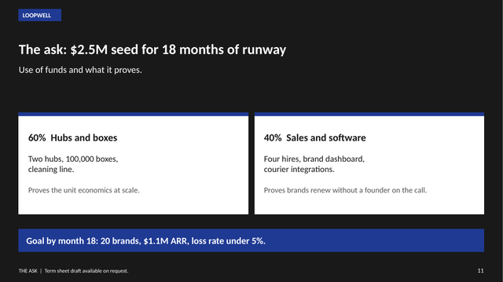 | **`closing`** dark closing slide with contact lines<br>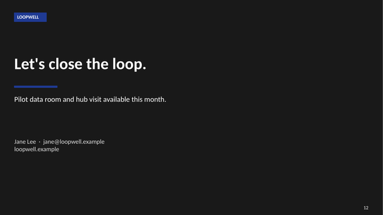 |

## Themes

| preset | accent | notes |
|---|---|---|
| `gold` (default) | `FFC627` | dark text on the accent; good for institutional decks |
| `navy` | `1F3A93` | pitch decks, corporate |
| `forest` | `2E7D4F` | reports, sustainability, education |
| `coral` | `E4573D` | consumer, energetic |
| `violet` | `6A4C93` | creative, community |
| `sky` | `1E88E5` | product, SaaS |
| `mono` | `191919` | print-like, neutral |

Every preset also sets the text colour used on the accent, the callout tint, the panel
tint and the link colour. Override any token: `{ "preset": "sky", "accent": "1E6FFF" }`.

**CJK decks** (Chinese, Japanese, Korean): set `"font": "Microsoft JhengHei"` (or
`PingFang TC`, `Noto Sans TC`, `Yu Gothic`, `Malgun Gothic`) in `theme`; the default
Calibri has no CJK glyphs. The overflow estimator is CJK-aware.

## Examples

| spec | theme | what it shows |
|---|---|---|
| [`examples/pitch-deck.json`](examples/pitch-deck.json) | navy | 12-slide seed pitch: cover with image, section, stats, flow, image, chart, cards, table, timeline, bullets, next, closing |
| [`examples/class-report.json`](examples/class-report.json) | forest | 7-slide class assignment: numbered questions, bar chart with insight, quote, cards, references |
| [`examples/team-update.json`](examples/team-update.json) | gold | 10-slide evidence-based team update: options, stats with caveat banner, decision agenda, next milestone, references, technical appendix |

Rendered previews are in [`docs/previews/`](docs/previews). `npm test` builds all three.

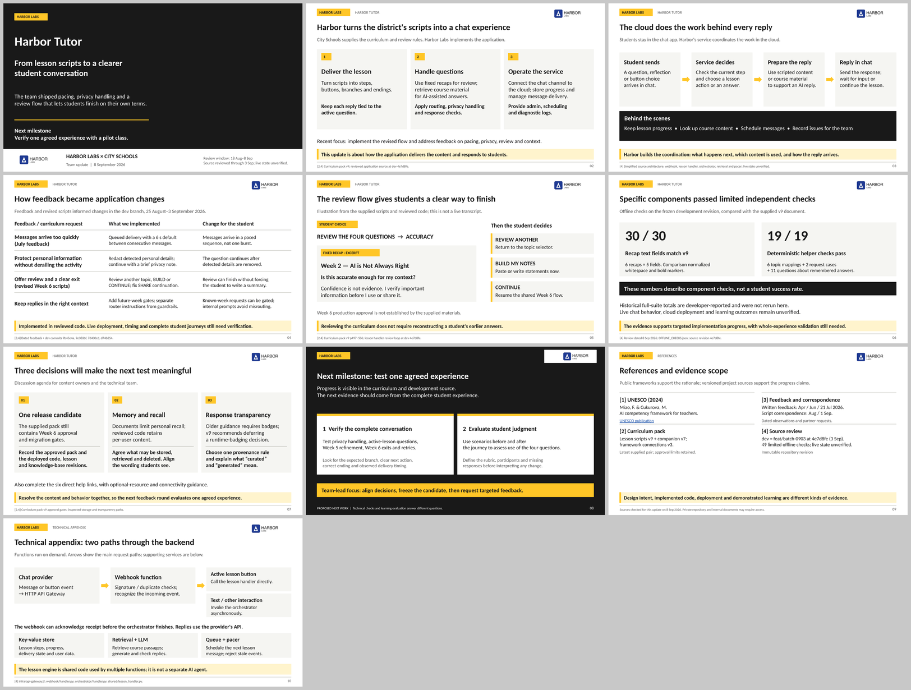

## How the skill guides the agent

[`SKILL.md`](SKILL.md) is the part the agent reads. It fixes the order of decisions
(purpose → titles → types → spec), sets writing limits (title ≤ 60 chars, card body ≤ 3
lines, callout ≤ 105 chars), forbids the usual AI-deck tells (topic-label titles, bullet
walls, decorative accents, invented sources) and requires the render-and-look step before
delivery.

## Development

```bash
npm install
npm test                     # builds every example into out/ and checks the zip
sh scripts/render.sh out/pitch-deck.pptx out/render   # visual check
```

To add a slide type: implement it in `scripts/build_deck.js` (`types.<name>`), document
the fields in `references/slide-types.md`, add it to one example, and add a gallery image.
See [CONTRIBUTING.md](CONTRIBUTING.md).

## 中文說明

`slides` 是給 coding agent（Claude Code、Codex、Cursor）用的簡報產生 skill。
Agent 只負責把內容填進 JSON spec，版面、顏色、字級由腳本統一處理，產出的是可在
PowerPoint / Keynote / Google Slides 繼續編輯的原生 `.pptx`，不是圖片。

- 安裝：`git clone https://github.com/Rich627/slides-skill ~/.claude/skills/slides && npm install --prefix ~/.claude/skills/slides`
- 用法：跟 agent 說「用 slides 幫我做一份 X 的簡報，navy 配色，10 頁」，或自己改
  `examples/*.json` 後跑 `node scripts/build_deck.js deck.json out/deck.pptx`。
- 中文簡報請在 `theme` 設 `"font": "Microsoft JhengHei"`；標題建議 26 字以內。
- 15 種版型與欄位說明見 `references/slide-types.md`；各用途的故事線骨架見
  `references/storylines.md`。

## License

MIT © 2026 Rich Liu
